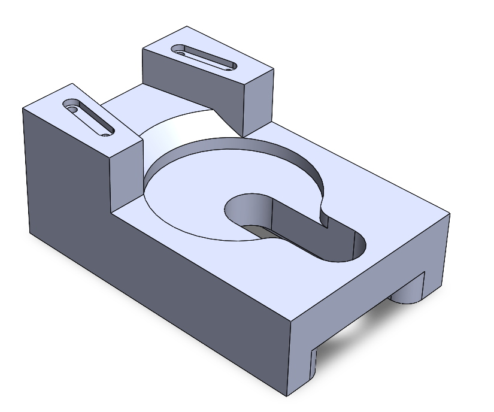

<table>
<tr>
<td>

# CAD Portfolio

Welcome to my engineering portfolio.

My name is **Svetozar Losev**, and I am a **first-year Mechanical Engineering student**. I am interested in mechanical design, automation, and CAD technologies.

This repository showcases my projects created in **SolidWorks**, including 3D models, technical drawings, assemblies, and engineering documentation. The purpose of this portfolio is to document my learning progress and demonstrate my engineering and CAD skills.

</td>
<td width="250">

</td>
</tr>
</table>

## Skills

* SolidWorks
* Technical Drawings
* Part Modeling
* Assembly Design
* Engineering Documentation
* CAD Design

## Projects

| Preview                                                      | Project                                               | Description                                                      |
| ------------------------------------------------------------ | ----------------------------------------------------- | ---------------------------------------------------------------- |
|  | [Alignment Catch](projects/Alignment_Catch/README.md) | A mechanical fixture designed to hold and align a mating component. |

## Software

* SolidWorks
* Git
* GitHub

## Contact

* Email: [jollysmoose@gmail.com](mailto:jollysmoose@gmail.com)
* Telegram: [@LosevSvetozar](https://t.me/LosevSvetozar)